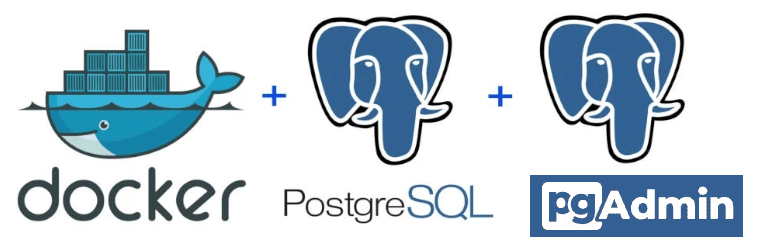

# TP Final

<br>

## Herramientas
<table border="0">
  <tr valign="center">
    <td></td>
  </tr>
</table>
<br>

## Contenido

<table border="0">
  <tr valign="center">
    <td colspan="2">TP Final</td>
  </tr>
  <tr valign="center">
    <td>docker-compose.yml</td>
    <td># Archivo de configuración de Docker Compose para generar el entorno</td>
  </tr>
  <tr valign="center">
    <td>init_lego_db.sql</td>
    <td># Sentencias de inicialización de la DB</td>
  </tr>
  <tr valign="center">
    <td>Relacional.pdf</td>
    <td># Consignas</td>
  </tr>
</table>
<br>

## Set Up

Ejecutar el siguiente comando para generar el entorno (PostgreSQL + pgAdmin):

```Bash
docker-compose up -d
```

Ejecutar el siguiente comando para verificar el estado de los contenedores:
```Bash
docker ps -a
```

Acceso a pgAdmin: http://localhost:8081

<br>


## Entregable
<table border="0">
  <tr valign="center">
    <td></td>
    <td><a href="./CEIA_BDIA_TP_FINAL_a1618.pdf" target="_blank">Entregable TP Final</a></td>
  </tr>
</table>
<br>
